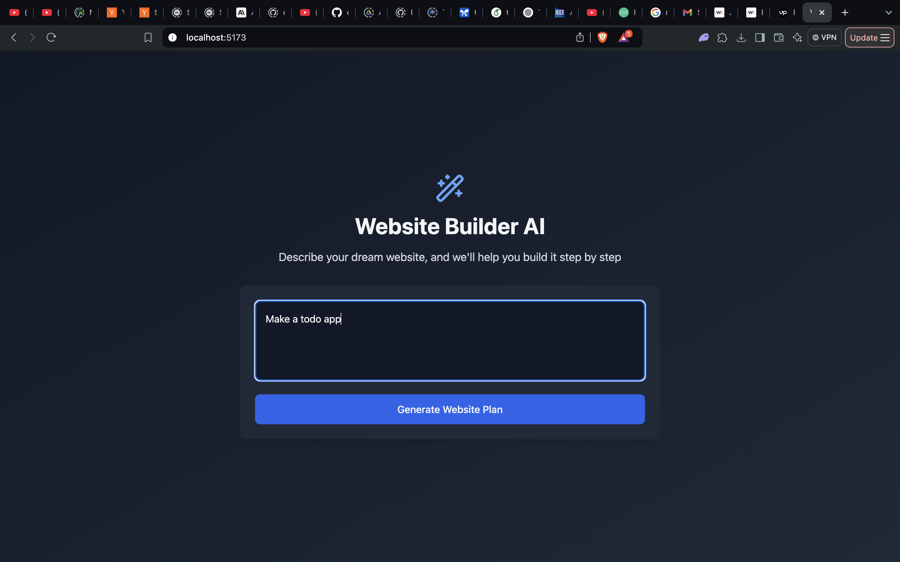
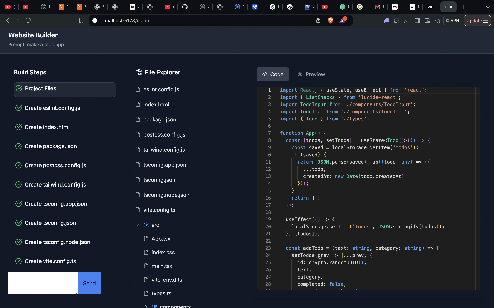
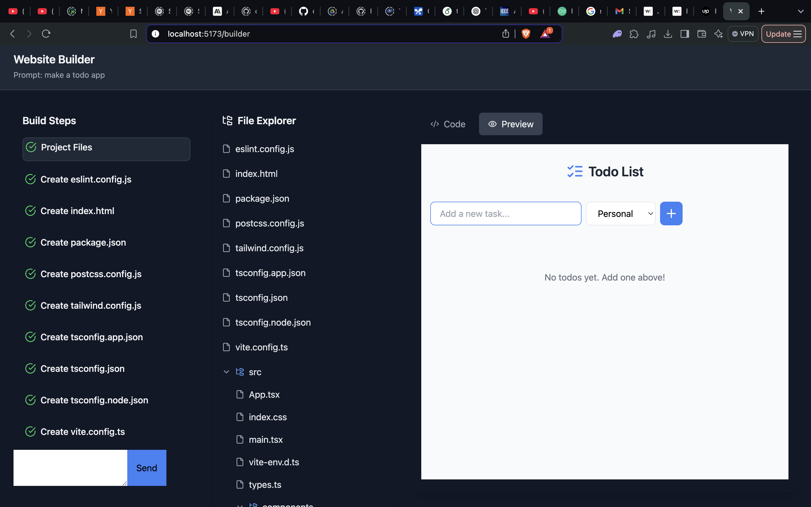
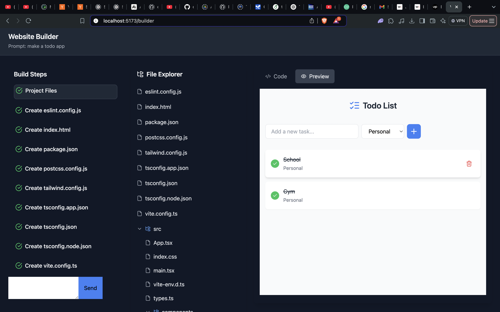

# 🧠 AI-Powered Coding Assistant

An intelligent and interactive web application that helps developers write, review, and preview code using the power of Large Language Models (LLMs). This assistant enables natural language-based prompts to generate, refine, and preview HTML, CSS, and JavaScript code in real-time.

## 🚀 Features

- 🗣️ **Natural Language to Code**: Use plain English to describe what you want—HTML components, styles, layouts, etc.—and generate working code.
- 🧱 **Code Builder Interface**: Easily input prompts and view generated HTML/CSS/JS code.
- 🔍 **Live Preview**: Instantly see how your generated code looks in the browser.
- 📜 **Prompt History**: Keeps track of your previous prompts for better reference and iteration.
- ⚙️ **LLM API Integration**: Leverages LLMs (like OpenAI’s GPT) to interpret prompts and generate code dynamically.

## 🛠️ Tech Stack

- **Frontend**: React, Tailwind CSS
- **Backend**: Node.js, Express
- **LLM API**: OpenAI GPT API (can be replaced with any LLM provider)
- **Other Tools**: Axios, dotenv

## 📸 Screenshots

### 🔹 Home Page


### 🔹 Prompt Builder Interface


### 🔹 Code Preview (HTML/CSS Output)


### 🔹 Another Example Preview


## 🧪 Local Setup

1. **Clone the repository**
   ```bash
   git clone https://github.com/your-username/ai-coding-assistant.git
   cd ai-coding-assistant
